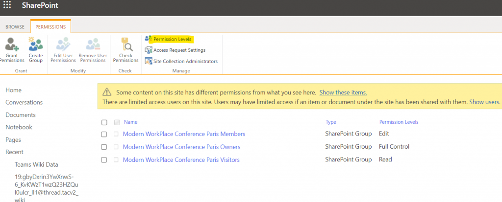
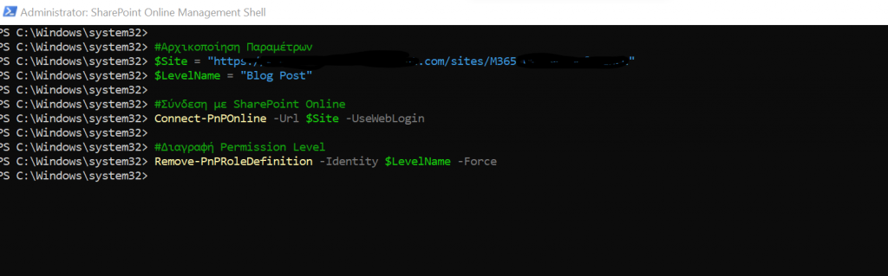

----
>  ## Title :  ... 
>  
>  Description :  ... 
----
<p>In today's article I will show you how ... </p>

<p>First we select ... </p>




```
#Initialize Variables for the excecution
$Site = "https://mytenant.sharepoint.com/sites/Mysite"
$LevelName = "Blog Post"
#Open Connection with SharePoint Online
Connect-PnPOnline -Url $Site -UseWebLogin
 
#Delete Permission Level Using PnP 
Remove-PnPRoleDefinition -Identity $LevelName -Force
```




<p></p>


